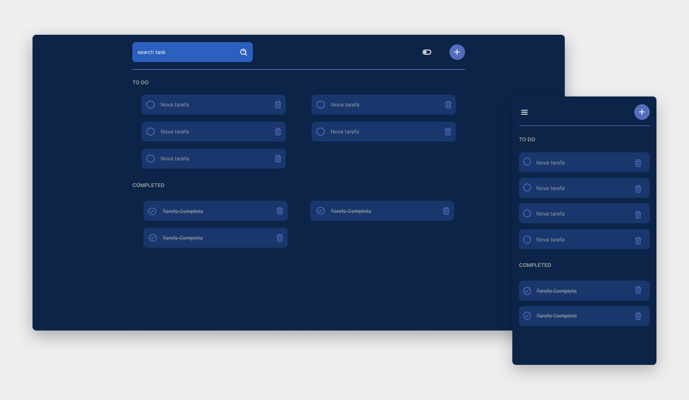

# Todo List

Este é um projeto simples de uma lista de tarefas para ajudá-lo a gerenciar seu tempo e aumentar sua produtividade. 
Com este aplicativo, você pode facilmente adicionar, remover, pesquisar e marcar tarefas como concluídas. O aplicativo é intuitivo e fácil de usar.

## Tecnologias Utilizadas

- HTML
- CSS
- JavaScript

## Funcionalidades

- O usuário pode criar uma nova tarefa ao clicar no botão com o ícone de “+”
- O usuário também pode marcar a tarefa como concluída ou até mesmo remove-la.
- Caso não encontre a tarefa, o usuário pode pesquisa-la fazendo com que a tarefa seja destacada com uma cor diferente.

#

